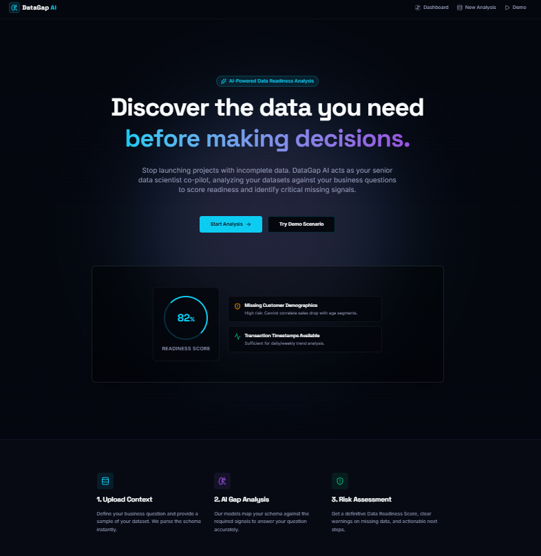
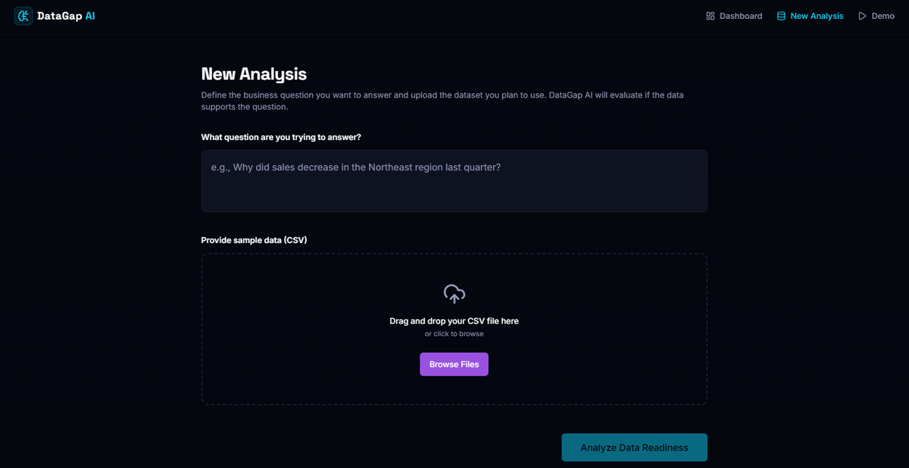
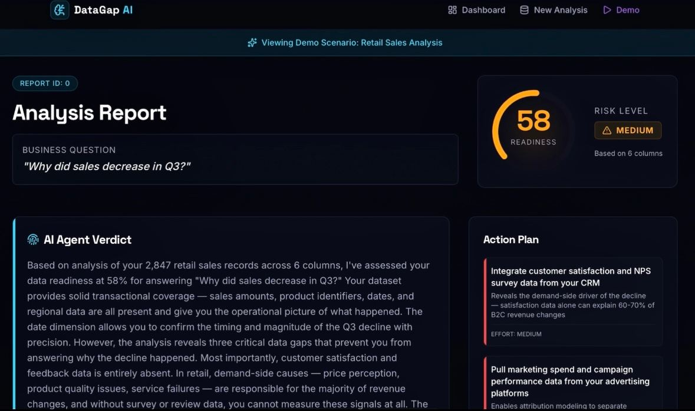

# DataGap AI

DataGap AI: Measuring Data Readiness for Smarter Decisions.

An AI-powered Data Readiness Assistant that helps users identify missing data and assess whether a dataset is ready to support a business decision.

🔗 [View Project Portfolio](https://try.ka.nz/ai/salmaawiwe)

Overview

Organizations often begin data analysis without realizing that their datasets are missing important information.

DataGap AI addresses this problem by analyzing uploaded CSV or Excel datasets against a business question. It evaluates the dataset structure, data quality, and coverage to identify potential data gaps before analysis begins.

How It Works

1. Upload a CSV or Excel dataset.
2. Enter a business question.
3. Analyze the dataset structure, quality, and coverage.
4. Generate a Data Readiness Score.
5. Identify missing data and potential blind spots.
6. Receive recommendations to improve data readiness.

Key Features

- Automated analysis of CSV and Excel datasets
- Analysis against natural language business questions
- Data Readiness Score to quantify analysis risk
- Identification of missing data and potential blind spots
- Actionable recommendations for additional data collection
- Interactive dashboard for visualizing data limitations and potential impacts

Analysis Report

DataGap AI generates an analysis report that presents the Data Readiness Score, risk level, identified data gaps, and recommended actions.

Technologies

- Python
- Replit
- AI-assisted development
- Data Analysis
- Power BI

My Contribution

Developed DataGap AI as an AI-powered Data Readiness Assistant.

- Refined the AI evaluation logic to distinguish between noisy data and missing data.
- Improved dashboard usability to present data readiness results clearly.
- Tested multiple business scenarios to improve the relevance and consistency of recommendations.
- Designed the workflow for analyzing dataset readiness against business goals.

Project Recognition

🏆 AI Judge Rating: Gold

Kanz AI Program — July 2026

🔗 [View Full Project Portfolio](https://try.ka.nz/ai/salmaawiwe)
